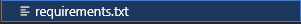

# Hangman Game

## Content
- [Site Owner Goals](#site-owner-goals)
- [User Experience](#user-experience)
    - [User Stories](#user-stories)
        - [First Time User](#first-time-user)
        - [Returning User](#returning-user)
        - [Frequent User](#frequent-user)
- [Design and Flow](#design-and-flow)
    - [Flow Chart](#flow-chart)
    - [Headings](#headings)
    - [Heroku](#heroku)
- [Google Sheet](#google-sheet)
- [Features](#features)
    - [Main Menu](#main-menu)
    - [Instructions](#instructions)
    - [Scoreboard](#scoreboard)
- [The Game](#the-game)
    - [Category Selection](#category-selection)
    - [The Game Word](#the-game-word)
    - [Updating Hint](#updating-hint)
    - [Colored Error Messages](#colored-error-messages)
    - [Game Over Conditions](#game-over-conditions)
    - [Game Won Conditions](#game-won-conditions)
    - [Score calculation](#score-calculation)
    - [Scoreboard Update](#scoreboard-update)
    - [End of Game](#end-of-game)
- [Testing](#testing)
- [Technologies Used](#technologies-used)
    - [Languages](#languages)
    - [Programs Used - Frameworks - Libraries](#programs-used-frameworks-libraries)
    - [Python Libraries](#python-libraries)
- [Deployment](#deployment)
    - [Running the project locally](#running-the-project-locally)
- [Credits](#credits)
    - [Content](#content)
    - [Resources Used](#resources-used)
    - [Code](#code)
- [Fixed Bugs](#fixed-bugs)
- [Future Content](#future-content)
- [Acknowledgments](#acknowledgments)

## Site Owner Goals
- to provide the user with a fun Hangman game that is quick to complete 
- to provide the user with a game that challanges him in different categories
- to provide the user with a good structured program that is easy to navigate
- to provide a scoreboard wich logs the score to it and sorts it from best to worst, so the user can challange his old scores

## User Experience
### User Stories
#### First Time User
- I want to play a word-guessing game / Hangman game.
- I want the site read instructions on how to play.
- I want the program to be easy to navigate and use.
- I want to be able to test my knowledge in different categories.
- I want to take the quiz whenever, wherever.

#### Returning User
- I want to be able to try different categories or other words from the same category.
- I want different words in the same category.

#### Frequent User
- I want to save my highscore to a scoreboard.
- I want to see how well I did and compare myself to others.
- I want to play again, after I won the game.

## Design and Flow

### Flow Chart

The flow chart was used to plan and display the flow of the program. The chart was created with [Lucid Chart](https://lucid.app/documents#/home?folder_id=recent).
It displays the different decision makings throughout the project and shows that the user has a wide range of possibilities to choose from.

### Headings
- For the Headings I used the [ASCII text to Art converter](https://www.asciiart.eu/text-to-ascii-art).
    - The font size I used is **Doom**

### Heroku
- For the Heroku App Version I just center it.
- And gave it a background color `#635656d3`.

## Google Sheet

The Google Sheet for storing data can be found [here](https://docs.google.com/spreadsheets/d/1B0skz-1BNoWH-YB8X-lZyaupzcWZC7egMYKFBE739mQ/edit?gid=0#gid=0). The sheet **words** contains the categories with all the words in it. The sheet **scoreboard** stores all the scores of the users.

## Features

### Main Header

- A header for the game so the user knows that the Terminal is running and not displaying an error message.
- Used [ASCII Art](https://www.asciiart.eu/text-to-ascii-art) for it.
### Main Menu

- The Main Menu has four options for the user to choose from: Play Hangman, Game Instructions, Scoreboard and Exit the program.
- The input is validated so the user has to enter a number between 1-4, otherwise an error message is displayed and he has to choose again.

### Main Menu - Validation

- The user has to enter a number beetween 1-4 otherwise a Error Message will be displayed, informing that the choice is not valid.
- The message is printed in red, to draw attention to the fact, that something is wrong.

### Instructions

- The game instructions give an explanation on how to play the game and how the scoring system works.
- I used [ASCII Border Art](https://www.asciiart.eu/art-and-design/borders) for it. It should look like an old scroll.

### Back to main menu function

- Under the instructions there is a back to menu function printed.
- The User can decide if he wants to return to the menu or exit the program.
- The validation for the user input is the same as the main menu validation found [here](#main-menu---validation).

### Scoreboard

- Option 3 displays a scoreboard of previous players. It shows the 10 best scores. 
- The scoreboard is sorted by a score. This score is calculated by `seconds * 100 / (length of the word + wrong guesses left)`. 
- The lower the score, the better people performed.
- The sorting is done by using the open source data tool [Pandas](https://realpython.com/pandas-sort-python/). Pandas, a data analytic tool, is used to sort and display data frames that are in my above mentioned google word sheet in a separate spreadsheet.
- Under the scoreboard the [Back to main menu function](#back-to-main-menu-function) is called again.
- The validation for the user input is the same as the main menu validation found [here](#main-menu---validation).

## The Game

### Category Selection

- With option 1, five categories will be displayed and the user can choose in which category he wants to play the game.
- The input is validated so the user has to enter a number between 1-5, otherwise a error message is displayed and he has to choose again.

### The Game Word

- After the user chooses a category, the game will display the word in hints of “_” according to the length of the word.
- The word is picked randomly form the google sheet and according to the category the user chooses.

### Updating Hint

- The user can only choose one letter at a time.
- If the letter is guessed correctly, the game word will be updated and the hint "_" will be replaced by the correctly guessed letter.

- If a letter is occurring more than once in the word, it will also be shown multiple times.

- If the user guesses the wrong letter, a red message will be displayed and the hangman figure will be updated.

- If a wrong guess occurs the user also loses a life.

- If a letter was already guessed and the user guesses it again, a message will be displayed informing the user about the recurring guess.

- The terminal will after every guess, right or wrong display the already guessed letters and the guesses left

### Colored Error Messages

- To inform the user something was not correct and if the guess was the wrong type of input a print message will be displayed in red.
- I used [colorama](https://pypi.org/project/colorama/) for this.

### Game Over Conditions

- If the user has no more lives left and the hangman figure is completly drawn the game is over.
- Under the game over header the word that was looked for will be displayed.
- The user can than choose from 3 options what to do next.

### Game Won Conditions

- If the user guesses every character correctly a Game Won Header will be displayed.
- Underneath it the user can see his score and can choose what to do next.

### Score calculation

- The score is calculated by `seconds * 100 / (length of the word + wrong guesses left)`.
- The lower the score, the better.

### Scoreboard Update

- If user chooses option 1 he is required to enter a username, so the score can be added to the scoreboard.
- If the username was entered correctly, and followed the only letters, max 12 letters.
- The current scoreboard will be displayed.

### End of Game

## Testing
See the testing results in the [TESTING.md](TESTING.md) file.

## Technologies Used
### Languages
Python, CSS

### Programs Used - Frameworks - Libraries

- [GitHub](https://GitHub.com/) - for version control and hosting.
- [Gitpod](https://gitpod.io/) - IDE to develop the website.
- [Am I Responsive](https://ui.dev/amiresponsive) to test responsiveness.
- [Heroku](https://dashboard.heroku.com/) - Used to deploy the project.
- [Lucid Chart](https://www.lucidchart.com/pages/) - Used to create a flow chart.
- [PEP8 Validator](https://pep8ci.herokuapp.com/) - Used to validate the Python code.
- Code Institute's Gitpod Template to generate IDE workspace.

### Python Libraries

- [random](https://docs.python.org/3/library/random.html) - Used to randomly select a word for the game.
- [os](https://docs.python.org/3/library/os.html) - Used to clear the terminal.
- [time](https://docs.python.org/3/library/time.html) - Used to start and stop the timer for the game.
- [math](https://docs.python.org/3/library/math.html) - Used to round down numbers and calculate a score.
- [colorama](https://pypi.org/project/colorama/) - Used for coloring of error messages.
- [pandas](https://pandas.pydata.org/) - Used to sort scoreboard and display it.
- [gspread](https://docs.gspread.org/en/latest/) - Used to access data in a Google Sheet and update them.
- [google.oauth2.service_account](https://pypi.org/project/python-oauth2/) - Used for authentification to access the Google Cloud.

## Deployment
This site was deployed to [Heroku](https://dashboard.heroku.com/login).

**How to deploy the project:**
- Get a list of requirements that the project needs to run and put them into a txt file. Heroku will install these dependencies so the program is running correctly.

- Go to the Heroku website.
- Choose option "creat new app".
- Go to settings and navigate to "Reveal Config Vars".
 - Enter CREDS in key and copy your creds.json file and past it into the VALUE field.
 - Enter PORT in key and 8000 in the VALUE field.
- Select "Add buildpacks" next.
 - Choose the `Python` buildpack first and the `node.js` second.
- Go to the deploy option.
- Select GitHub as your deployment option.
- Confirm the connection to Github and choose the correct repository.
- Select "Enable Automatic" and "Deploy branch" with the selection **main**.
- Select "view" to see the live website.

**How to set up credentials and Google Sheets:**
- Creat a new sheet via Google Sheets.
- Go to [Google Cloud Platform](https://console.cloud.google.com/welcome).
    - Creat a new project.
    - Afterwards go to "APIs and Services" and select "library".
    - Enable the [Google Drive API](https://console.cloud.google.com/apis/library/drive.googleapis.com).
    - Next we have to create **credentials**. Press "Create credentials" for that.
    - Afterwards go login data and select keys.
    - Create a new key and select JSON.
    - A JSON file will be downloaded to your machine. This you just pull into your GitPod repository.
    - Last enable the [Google Sheets API](https://console.cloud.google.com/apis/library/sheets.googleapis.com).
### Running the project locally
How to Fork:
- Login to Github
- Go to the GitHub repository: Project_3
- Select the Fork button on the right at the top

How to clone:
- Login to Github
- Go to the GitHub repository: Project_3
- Select the code button, select whether you would like to clone with HTTPS, SSH or GitHub CLI and copy the link shown.
- Open the terminal in your code editor and change the current working directory to the location you want to use for the cloned directory.
- Type 'git clone' into the terminal and then paste the link you copied in step 3. and enter.
- A clone will be created.

## Credits

### Content
The Hangman Game contains names from movies and video games. All names belong to their respective owners.

### Resources Used
- Code Institute's lessons (love sandwiches project)
- [Stack Overflow](https://stackoverflow.com/)
- [W3Schools](https://www.w3schools.com/)
### Code

## Fixed Bugs

## Future Content
- I'm pretty happy with the website, would probably add the time to complete to the scoreboard aswell.

## Acknowledgments
My mentor Jubril Akolade for his guidance, input and support.

The Slack community on Code Institute for reviewing my project and for support.

Code Institute for informational courses.